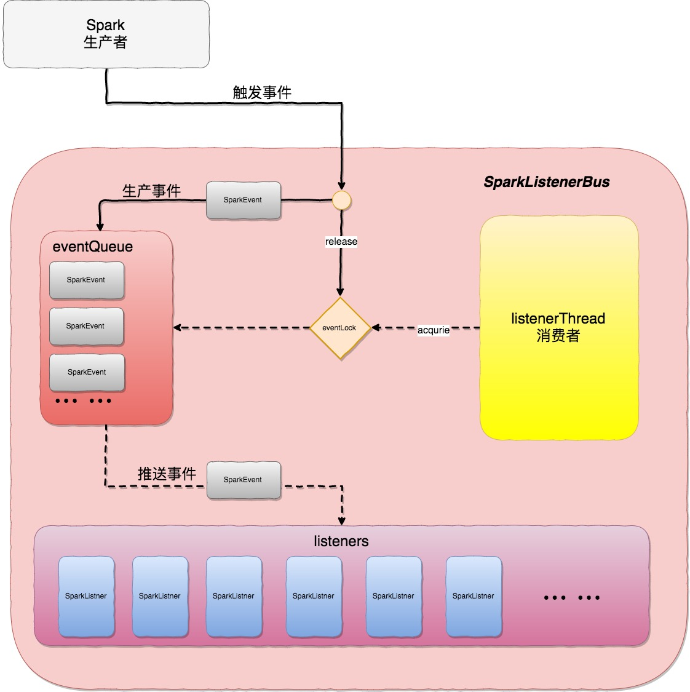

# Spark监听器总线-SparkListnerBus

## 注解

##### 概述

在Spark的创建过程中，会创建一个LiveListenerBus的实例。主要功能是

- 消息缓存
- 消息分发

是Spark的监听器总线，需要发送事件消息的组件将发生的事件消息提交到总线，然后总线将事件消息转发给一个个注册在它上面的监听器，最后监听器对事件进行响应。
LiveListenerBus继承自SparkListenerBus，SparkListenerBus继承自ListenerBus。

##### listners

listeners是一个L（listener）类型的CopyOnWriteArrayList，以保证我们可以对listeners这个ArrayList进行并发的读，而不需要加锁。

##### eventQueue

事件队列，是一个典型的生产者消费者问题的场景。  

##### listenerThread

listenerThread是一个守护线程，不断地从事件队列中消费事件，并推送给所有的监听器。
在取事件之前要先获取信号量。

在取到的事件为空时，返回。

##### eventLock

eventLock是一个信号量，用于控制事件的生产和消费。
当生产一个事件时，release信号量，eventLock+1；在消费事件、即将事件推送listener之前，需要先获取信号量。

同时eventLock还可以用于控制监听器总线的安全关闭，事实上调用SparkListenerBus的stop方法，同样也会释放一次信号量。这使得监听器的守护线程在事件队列为空的情况下不会被阻塞，取出一个null事件使得守护线程的run()方法返回，从而使得监听器的守护线程终止。

